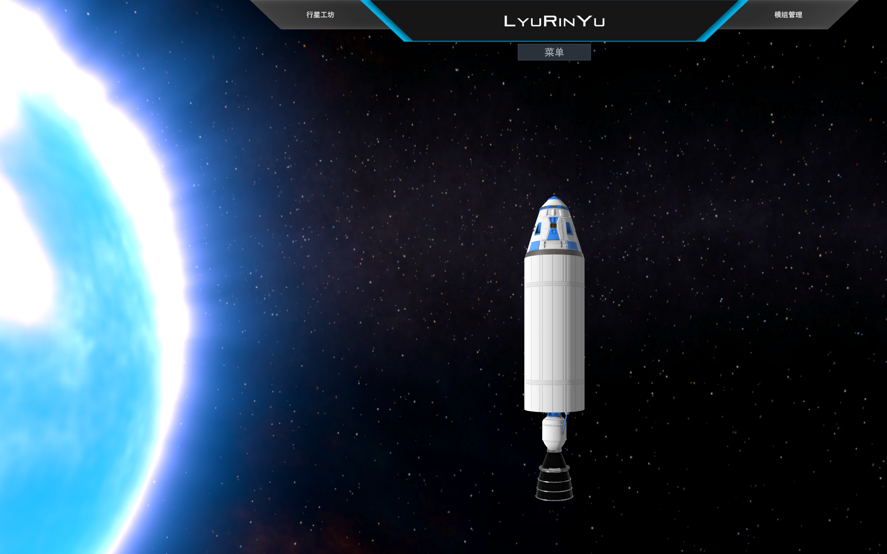

# Juno: New Origins 简体中文汉化

> **Juno: New Origins**（原名 SimpleRockets 2）的简体中文语言包 —— 完整汉化 **9318 / 9318 条**界面文本（100%）。
> 基于游戏**官方多语言机制**制作，不改动游戏逻辑，可一键安装 / 一键还原。

作者：**LyuRinYu**



---

## 特性

- **100% 覆盖**：主菜单、设置、建造器、零件、行星工坊、生涯合约、教程、飞行界面、Vizzy 可视化编程等全部模块
- **零侵入安装**：语言包放在用户数据目录，通过游戏官方语言机制加载 —— 不改 DLL、不注入、不装 BepInEx，**不影响存档 / 成就 / 云同步**
- **跨版本兼容**：游戏里没有的条目自动显示英文，多出来的条目自动忽略 → 低版本 / 高版本都不会报错或崩溃
- **一键安装 / 一键还原**：安装包内含 `安装.bat` / `卸载.bat`
- **自带中文字体**：基于 Noto Sans SC 实例化的静态字重（OFL 许可，可自由分发）
- **完整工具链**：从切分批次、并行翻译、术语一致性扫描到打包发布，全部脚本开源

## 下载安装

前往 [Releases](../../releases) 下载 `Juno新起源-简体中文汉化包-vX.X.zip`，解压后：

1. 双击 **`① 一键安装汉化.bat`**
2. 启动游戏 —— 已经是中文了

> 不想让安装脚本改动游戏文件的用户，可以双击
> `程序文件（勿删）\安装-仅语言包（不改游戏文件）.bat`（只装语言包，不碰 DLL）。
>
> 想还原原版：双击 **`② 卸载还原.bat`**。

## 原理

游戏内置了官方本地化系统（`ModApi.Locale`），语言包就是一组键值对：

```
%USERPROFILE%\AppData\LocalLow\Jundroo\SimpleRockets 2\Languages\<语言代码>\
    Strings.xml      # <s id="键">译文</s>
    Fonts.xml        # 中文字体注册（可选，中文必需）
    字体文件.ttf
```

游戏启动时扫描该目录，**凡含 `Strings.xml` 的文件夹都会出现在语言下拉列表里**；
未翻译的键自动回落英文，所以可以渐进式汉化。详见 [docs/技术说明.md](docs/技术说明.md)。

## 目录结构

```
├── translations/           译文数据（唯一权威数据源）
│   ├── zh_cn.json          id -> 中文，9318 条
│   ├── glossary.tsv        术语表（翻译与校对共用）
│   └── 校对对照表.tsv       全量中英对照（编辑后可用 import_revisions.py 回灌）
├── scripts/                工具链
│   ├── build_zh_cn.py      构建 + 强校验 + 安装
│   ├── checklib.py         校验核心（占位符 / @记号 / %记号% / |绑定记号| / 括号标记 / (N:Type)）
│   ├── consistency_check.py 术语一致性 + 漏译扫描
│   ├── export_review.py / import_revisions.py   导出校对表 / 回灌修改
│   ├── replace_term.py     术语全局替换
│   ├── prepare_font.py     生成带署名的中文字体
│   ├── apply_signature.py  多层署名（含不可见水印）
│   ├── build_package.py    生成可分发安装包
│   └── restore_dll.py      还原游戏文件
├── packaging/              安装器源码（PowerShell，Windows 自带）
├── dll-patch/              主菜单版本号署名补丁（C# + Mono.Cecil）
└── docs/                   技术文档 / 开发指南 / 截图
```

## 开发

**前置条件**：Windows、Python 3.10+、一份正版游戏（用于读取官方英文源 `EN-US/Strings.xml`）

```bash
# 1. 校验译文（占位符 / 格式记号 / 换行等硬性规则）
python scripts/build_zh_cn.py --check

# 2. 构建并安装语言包（会走完整校验，不通过直接中止）
python scripts/build_zh_cn.py

# 3. 术语一致性扫描
python scripts/consistency_check.py

# 4. 重新打包发行版
python scripts/build_package.py
```

完整流程见 [docs/开发指南.md](docs/开发指南.md)。

## 贡献

欢迎提交译文修正！最简单的方式：

1. 打开 `translations/校对对照表.tsv`，找到要改的条目，把新译文填进「修改列」
2. 运行 `python scripts/import_revisions.py`（会自动校验 + 重建）
3. 提交 PR

**⚠ 翻译硬性规则**（违反会导致游戏内 UI 损坏，`checklib.py` 会拦截）：

| 规则 | 说明 |
|---|---|
| 占位符 | `{0}` `{1}` `{0:n1}` 必须逐字保留、数量一致 |
| `@记号` | `@Count` `@Apoapsis:distance` `@Count:plural(载荷\|载荷)` —— 记号名不得翻译；`plural()` 括号内可译但分支数必须一致 |
| `%记号%` | `%ActivateInstruction%` 原样保留 |
| `\|绑定记号\|` | `\|Brake;+\|` `\|Vizzy.EventVariable.Part\|` 整体照搬（教程按键提示） |
| 方括号 | `[highlight]` 是纯标记必须原样；`[clicking\|tapping]` 是鼠标/触屏双端文本，内容可译 |
| `(N:Type)` | Vizzy 参数类型标注，原样保留 |
| 换行 | 真换行与字面量 `\n` 是两种东西，不要混淆 |
| 专有名词 | 行星名、物种名、型号代号、编程标识符（sin/cos/true/false）保留英文原文 |

术语约定见 `translations/glossary.tsv`，待定项见 `docs/待定术语.md`。

## 许可

- **脚本代码**：MIT（见 [LICENSE](LICENSE)）
- **中文译文**：CC BY-NC-SA 4.0（署名 · 非商业性使用 · 相同方式共享）
- **字体**：[SIL Open Font License 1.1](packaging/OFL.txt)（基于 Noto Sans SC，允许修改与再分发）
- **游戏原文**：版权归 **Jundroo, LLC** 所有；`translations/校对对照表.tsv` 中的英文原文仅为翻译对照学习之用

## 免责声明

本项目为**非官方**汉化，与 Jundroo, LLC 无关联。请支持正版。

作者信息分布在本项目的多个位置（主菜单版本号、菜单条目、译文内嵌不可见水印、字体元数据）。
移除署名后再分发属于剽窃；可使用 `packaging/verify_signature.ps1` 核验出处。

## 致谢

- [Jundroo, LLC](https://www.jundroo.com/) —— 开发了 Juno: New Origins，并提供了这套优秀的官方多语言机制
- [Noto Sans SC](https://fonts.google.com/noto/specimen/Noto+Sans+SC) —— 中文字体
- [Mono.Cecil](https://github.com/jbevain/cecil) —— DLL 补丁工具
